Spatial Association Rules For Geomarketing Purposes
================
Alessandro Festi
04 giugno 2019

<center>
Alessandro Festi
</center>
<br/>

<font size = '2'> Market basket analysis is a widely employed technique in marketing which provides suggestions of products to buy to a customer, given the past purchases made by the customers, basing upon the statistical methodology of association rules. This technique has been initially conceived to analyse transactions of products where the dataset is composed of sets of items purchased in different periods of time by N individuals, for instance formed from a large number of receipts collected in a point of sale of a large-scale retail trade. This chapter extends the application of market basket analysis to the geolocation points of N people in a specific space in order to discover associations among places that individuals have visited. When dealing with products, the goal is to link products while here it is linking locations. Similarly, one needs the sets of geolocation points for each individual considered in many different occasions. <br/> This code follows my article published by Springer </font>

``` r
library(geosphere)
library(rgeos)
library(shiny)
library(leaflet)
library(plyr) 
library(dplyr)
library(jsonlite)
library(arules)
library(MASS)
library(sp)
library(taRifx)
library(arulesViz)
library(readr)
library(tidyr)
library(raster)
library(ggplot2)
library(RColorBrewer)
library(readr)
library(readxl)
```

An overview of the iperbole dataset, downloadable here: <http://dati.comune.bologna.it/node/640>

<center>
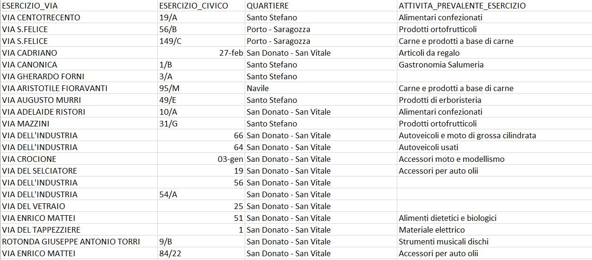
</center>
<br/>

The R package 'reticulate' helps us integrating the Python language in the R environment. In the Iperbole dataset there are not latitude and longitude coordinates for the commercial activities in Bologna. We can get them using the geographic information we already have and geocoding it through the Mapbox API's using Python. Then the general analysis is implemented using R. <br/>

``` r
library(reticulate)
```

    ## Warning: package 'reticulate' was built under R version 3.4.4

``` r
use_python('C:\\Users\\afesti\\AppData\\Roaming\\Microsoft\\Windows\\Start Menu\\Programs\\Python 3.6')
```

``` python
import pandas as pd
import numpy as np 
from mapbox import Geocoder
import json

dataset = pd.read_csv("C:\\Users\\Alessandro\\elenco_esercizicommerciosedefissa_anno_2017.csv", sep = ';', header='infer', encoding='latin-1')

dataset['quartiere_settore'] = dataset.ESERCIZIO_VIA+'  '+dataset.ESERCIZIO_CIVICO+' '+dataset.QUARTIERE+' Bologna'

dataset['lat'] = float
dataset['lon'] = float

token = token
geocoder = Geocoder(access_token=token)

for i in range(len(dataset)):
    try:
        response = geocoder.forward(dataset.quartiere_settore[i])
        ale = response.content
        d = json.loads(ale)
        coordinates = d["features"][0]['geometry']['coordinates']
        dataset.iat[i,29] = coordinates[1]
        dataset.iat[i,30] = coordinates[0]
    except:
        dataset.iat[i,29] = np.nan
        dataset.iat[i,30] = np.nan

dataset.to_excel('geocoded.xlsx')
```

``` r
geocoded <- read_excel("C:\\Users\\Alessandro\\Desktop\\geocoded.xlsx")
geocoded <- dplyr::distinct(geocoded, lat, lon, .keep_all = TRUE)
```

<br/> Having obtained their lat/lon coordinates, the position of the commercial activities in Bologna are plotted using Tableau <br/>
<center>
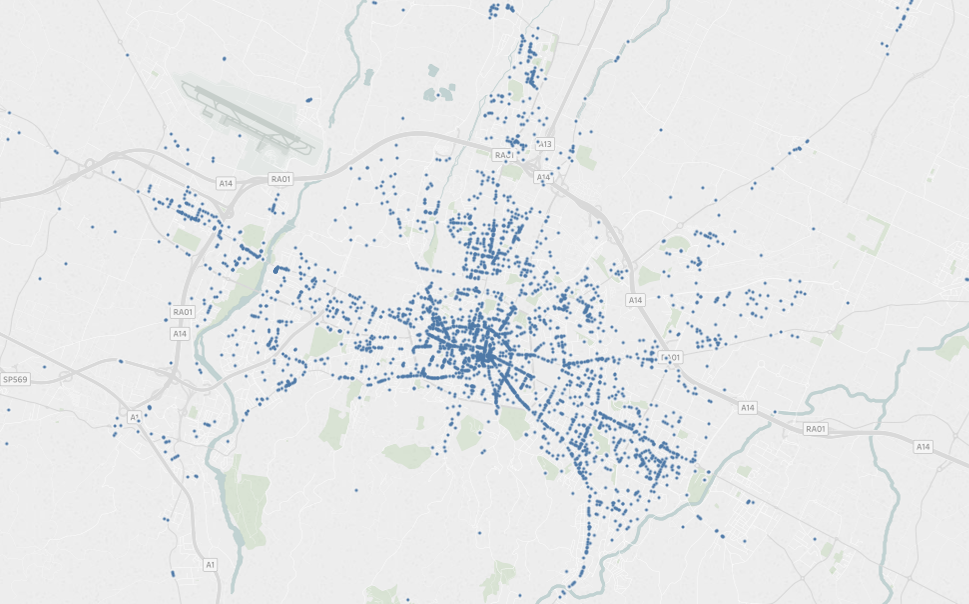
</center>
<br/>

Then the individual paths are simulated. In this case the number of simulated individuals is set to 50, each of them on 15 different occasions, geocoded 20 different times for each occasion. <br/>

``` r
n_individuals <- 50
n_paths <- 15
n_positions <- 20

points <- data.matrix(cbind(rnorm(n_individuals)/250 + 11.342220, rnorm(n_individuals)/250 + 44.493674)) 
correlation <- 0.7

paths_gen <- function(points) {
  paths_one <- c()
    for (j in 1:nrow(points)) {  
       for (i in 1:n_paths) {           
         mu <- rep(0,n_positions) 
         Sigma <- matrix(correlation, nrow=n_positions, ncol=n_positions) + diag(n_positions)*.3
         rawvars <- mvrnorm(n=n_positions, mu=mu, Sigma=Sigma) 
         geo_points <- as.data.frame(cbind(rawvars[,i]/250 + as.double(points[j]), rawvars[,i]/250 + as.double(points[j+nrow(points)])))
         gg <- cbind(geo_points, i, j)
         paths_one <- rbind(paths_one, gg)
       }
    }  
  return(as.data.frame(paths_one))
}

path_vis <- as.data.frame(paths_gen(points))
path_vis <- plyr::rename(path_vis, c("V1"="lon", "V2"="lat", "i"="path", "j"="ind"))
head(path_vis,10)
```

    ##         lon      lat path ind
    ## 1  11.33935 44.48807    1   1
    ## 2  11.34665 44.49537    1   1
    ## 3  11.34178 44.49050    1   1
    ## 4  11.34416 44.49288    1   1
    ## 5  11.34058 44.48930    1   1
    ## 6  11.34291 44.49163    1   1
    ## 7  11.33797 44.48669    1   1
    ## 8  11.34604 44.49476    1   1
    ## 9  11.34352 44.49224    1   1
    ## 10 11.34703 44.49575    1   1

Plotting the position of an individual on a path
<center>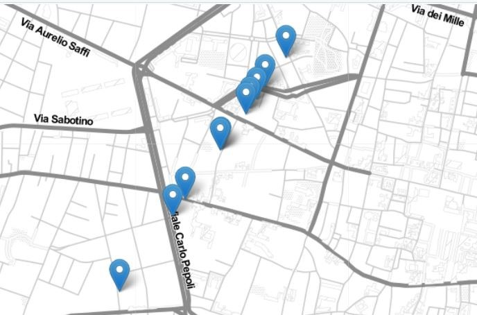</certer>

<br/>
Plotting the position of an individual on a path
<center>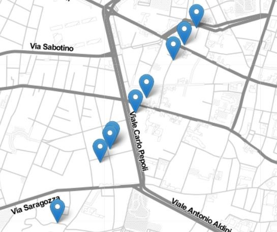</certer>

<br/>
Plotting the position of an individual on a path
<center></certer>

<br/> Then, in order to infer if a person was at a certain activity, the individual positions are matched with the positions of the geocoded commercial activities in Bologna on the basis of an arbitrary minimum distance(Euclidean distance).

``` r
path_v <- data.matrix(cbind(path_vis$lon,path_vis$lat))
places <- cbind(geocoded$lon, geocoded$lat)
places[is.na(places)] <- 0
min_dist <- 0.0005

assign <- function(geo_points) {
  geo_pointsTOplaces <- list()
    for(j in 1:nrow(path_v)) {
        x <- spDistsN1(places,path_v[j,], longlat = FALSE)
        x <- as.data.frame(x)
        qq <- which(x == min(x), arr.ind = TRUE)
        qq <- as.data.frame(qq) 
        nearest <- sort(x[x>0],decreasing=F)[1]
        geo_pointsTOplaces$distance[j] <- nearest
        if (nearest < min_dist) { 
          geo_pointsTOplaces$lon[j] <- places[qq[1,1],1]
          geo_pointsTOplaces$lat[j] <- places[qq[1,1],2]
        } else {
          geo_pointsTOplaces$lon[j] <- NA
          geo_pointsTOplaces$lat[j] <- NA 
        }
      }
  return(geo_pointsTOplaces)
}

result <- as.data.frame(assign(geo_points))
result <- as.data.frame(cbind(result$lon, result$lat, result$distance, path_vis$path, path_vis$ind))
result <- plyr::rename(result, c("V1"="lon", "V2"="lat", "V3"="dist", "V4"="path", "V5"="ind"))
head(result)
```

    ##        lon      lat         dist path ind
    ## 1       NA       NA 0.0016879663    1   1
    ## 2 11.34673 44.49548 0.0001317442    1   1
    ## 3       NA       NA 0.0005721107    1   1
    ## 4 11.34417 44.49312 0.0002404279    1   1
    ## 5       NA       NA 0.0006089587    1   1
    ## 6 11.34299 44.49179 0.0001758203    1   1

<font size = '2'> Adjusting the dataset for the association rules discovery eliminating the non-matched observations </font>

``` r
result <- na.omit(result)
head(result)
```

    ##        lon      lat         dist path ind
    ## 2 11.34673 44.49548 0.0001317442    1   1
    ## 4 11.34417 44.49312 0.0002404279    1   1
    ## 6 11.34299 44.49179 0.0001758203    1   1
    ## 7 11.33821 44.48682 0.0002777571    1   1
    ## 8 11.34556 44.49484 0.0004844213    1   1
    ## 9 11.34343 44.49244 0.0002176756    1   1

Merging process to retrieve the index of the matched company

``` r
index <- dplyr::select(geocoded,lat,lon, IND)
index <- plyr::rename(index, c("lat" = "lat", "lon" = "lon", "IND" = "ID"))
final <- merge(x=index, y=result, by.x = c("lon","lat"), by.y = c("lon","lat"))
final$itemset_id <- paste(final$ind,final$path)
head(final,10)
```

    ##         lon      lat   ID         dist path ind itemset_id
    ## 1  11.32834 44.48821 3561 3.247483e-04   11  20      20 11
    ## 2  11.32993 44.49048 2325 1.989156e-04   12  20      20 12
    ## 3  11.32993 44.49048 2325 3.135245e-04   11  20      20 11
    ## 4  11.33014 44.49086 2485 3.243349e-04    5  20       20 5
    ## 5  11.33070 44.49076 3122 2.503902e-04    9  20       20 9
    ## 6  11.33070 44.49076 3122 3.531150e-04   10  20      20 10
    ## 7  11.33070 44.49076 3122 2.107254e-04   10  20      20 10
    ## 8  11.33080 44.49036 6078 3.903161e-04    6  32       32 6
    ## 9  11.33080 44.49036 6078 2.281117e-04   12  39      39 12
    ## 10 11.33089 44.49056 6065 8.375626e-05    9  32       32 9

Then one needs to transform the data into a transaction dataset

``` r
# Preparing for Association rules
transactionData <- ddply(final,c("itemset_id"),
                         function(final)paste(final$ID,
                                              collapse = ","))
```

The dataset is read again into R as a transaction object. The most frequent visited companies are displayed in the absolute frequency plot below

``` r
write.csv(transactionData,"C:\\Users\\Alessandro\\Desktop\\transaction_data.csv", quote = FALSE, row.names = TRUE)
tr <- read.transactions('C:\\Users\\Alessandro\\Desktop\\transaction_data.csv', format = 'basket', sep=',')
```

    ## Warning in asMethod(object): removing duplicated items in transactions

``` r
itemFrequencyPlot(tr,topN=20,type="relative",col=brewer.pal(8,'Pastel2'), main="Absolute Item Frequency Plot")
```

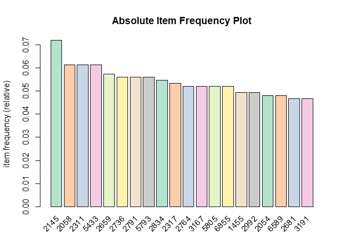 <br/> Performing the Market Basket Analysis through the apriori algorithm

``` r
association.rules <- arules::apriori(tr, parameter = list(supp=0.01, conf=0.3,maxlen=10))
```

    ## Apriori
    ## 
    ## Parameter specification:
    ##  confidence minval smax arem  aval originalSupport maxtime support minlen
    ##         0.3    0.1    1 none FALSE            TRUE       5    0.01      1
    ##  maxlen target   ext
    ##      10  rules FALSE
    ## 
    ## Algorithmic control:
    ##  filter tree heap memopt load sort verbose
    ##     0.1 TRUE TRUE  FALSE TRUE    2    TRUE
    ## 
    ## Absolute minimum support count: 7 
    ## 
    ## set item appearances ...[0 item(s)] done [0.00s].
    ## set transactions ...[2040 item(s), 751 transaction(s)] done [0.01s].
    ## sorting and recoding items ... [283 item(s)] done [0.00s].
    ## creating transaction tree ... done [0.00s].
    ## checking subsets of size 1 2 3 4 5 done [0.00s].
    ## writing ... [1744 rule(s)] done [0.00s].
    ## creating S4 object  ... done [0.00s].

``` r
inspect(association.rules[1:10])
```

    ##      lhs       rhs    support    confidence lift     count
    ## [1]  {1722} => {1966} 0.01198402 0.8181818  51.20455 9    
    ## [2]  {1966} => {1722} 0.01198402 0.7500000  51.20455 9    
    ## [3]  {2130} => {2341} 0.01065246 0.7272727  49.65289 8    
    ## [4]  {2341} => {2130} 0.01065246 0.7272727  49.65289 8    
    ## [5]  {1344} => {1695} 0.01198402 1.0000000  50.06667 9    
    ## [6]  {1695} => {1344} 0.01198402 0.6000000  50.06667 9    
    ## [7]  {2843} => {2681} 0.01065246 0.8888889  19.07302 8    
    ## [8]  {3016} => {2518} 0.01065246 0.8000000  23.10769 8    
    ## [9]  {2518} => {3016} 0.01065246 0.3076923  23.10769 8    
    ## [10] {2715} => {2834} 0.01065246 0.7272727  13.32151 8

``` r
plot(association.rules, method = "two-key plot")
```

    ## To reduce overplotting, jitter is added! Use jitter = 0 to prevent jitter.

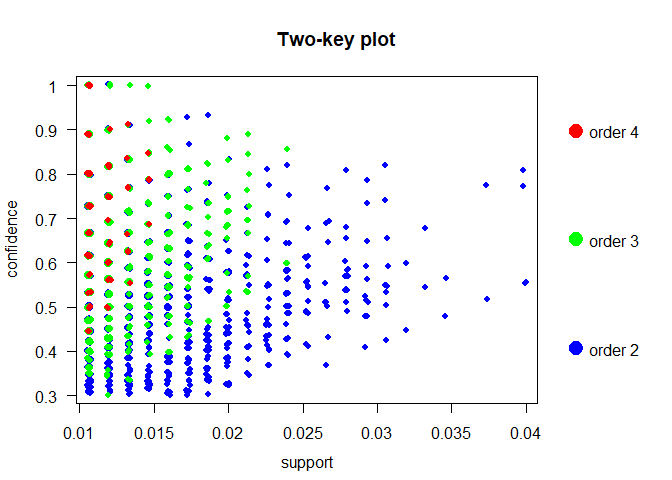

``` r
plot(association.rules, method = "graph")
```

    ## Warning: plot: Too many rules supplied. Only plotting the best 100 rules
    ## using 'support' (change control parameter max if needed)

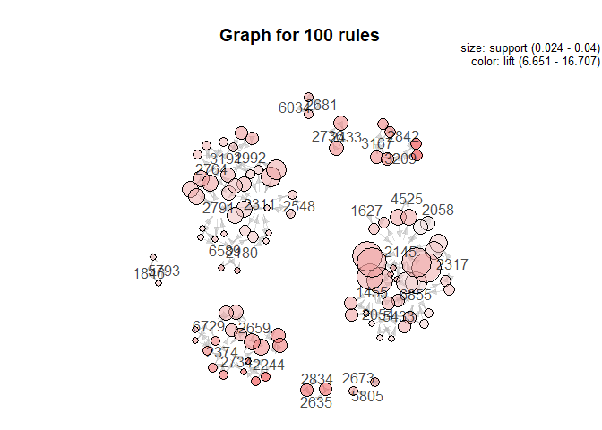

``` r
plot(association.rules[1:20], method = "graph")
```

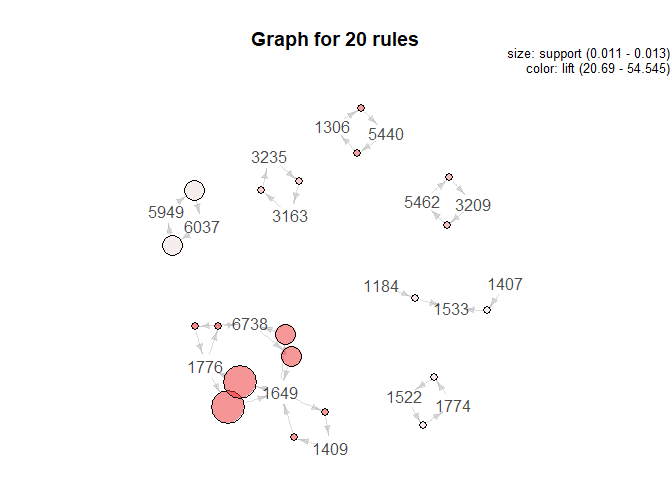 <br/> The same approach is applied, rather than on company indexes, on their commercial sector

``` r
index_cat <- dplyr::select(geocoded,lat,lon, ATTIVITA_PREVALENTE_ESERCIZIO)
index_cat <- plyr::rename(index_cat, c("lat" = "lat", "lon" = "lon", "ATTIVITA_PREVALENTE_ESERCIZIO" = "Commercial type"))
final_cat <- merge(x=index_cat, y=result, by.x = c("lon","lat"), by.y = c("lon","lat"))
final_cat$itemset_id <- paste(final_cat$ind,final_cat$path)
final_cat <- na.omit(final_cat)
head(final_cat)
```

    ##        lon      lat         Commercial type         dist path ind
    ## 4 11.33014 44.49086            Oggettistica 0.0003243349    5  20
    ## 5 11.33070 44.49076 Alimentari confezionati 0.0002503902    9  20
    ## 6 11.33070 44.49076 Alimentari confezionati 0.0003531150   10  20
    ## 7 11.33070 44.49076 Alimentari confezionati 0.0002107254   10  20
    ## 8 11.33080 44.49036   Gastronomia Salumeria 0.0003903161    6  32
    ## 9 11.33080 44.49036   Gastronomia Salumeria 0.0002281117   12  39
    ##   itemset_id
    ## 4       20 5
    ## 5       20 9
    ## 6      20 10
    ## 7      20 10
    ## 8       32 6
    ## 9      39 12

``` r
transactionData_cat <- ddply(final_cat,c("itemset_id"),
                         function(final_cat)paste(final_cat$`Commercial type`,
                                              collapse = ","))
```

``` r
write.csv(transactionData_cat,"C:\\Users\\Alessandro\\Desktop\\transaction_data_cat.csv", quote = FALSE, row.names = TRUE)
tr_cat <- read.transactions('C:\\Users\\Alessandro\\Desktop\\transaction_data_cat.csv', format = 'basket', sep=',')
itemFrequencyPlot(tr_cat,topN=10,type="relative",col=brewer.pal(8,'Pastel2'), main="Absolute Item Frequency Plot")
```

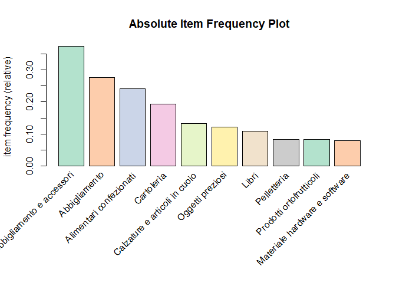 <br/> The positions of the commercial activities in Bologna are then plotted using Tableau according to their sector.

<center>
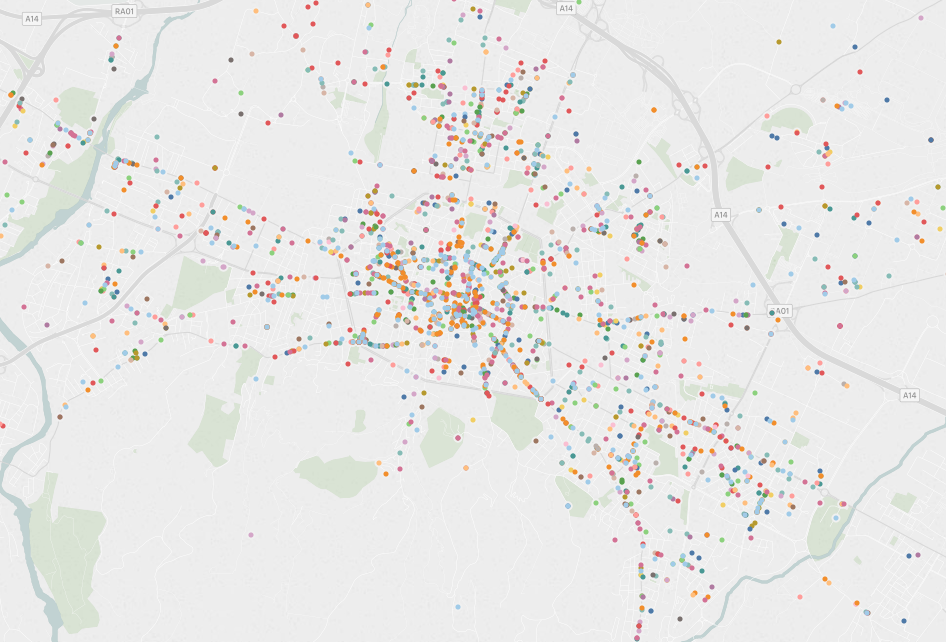
</center>
<br/> Performing the Market Basket Analysis through the apriori algorithm on the sector

``` r
association.rules_cat <- arules::apriori(tr_cat, parameter = list(supp=0.03, conf=0.5,maxlen=5))
```

    ## Apriori
    ## 
    ## Parameter specification:
    ##  confidence minval smax arem  aval originalSupport maxtime support minlen
    ##         0.5    0.1    1 none FALSE            TRUE       5    0.03      1
    ##  maxlen target   ext
    ##       5  rules FALSE
    ## 
    ## Algorithmic control:
    ##  filter tree heap memopt load sort verbose
    ##     0.1 TRUE TRUE  FALSE TRUE    2    TRUE
    ## 
    ## Absolute minimum support count: 21 
    ## 
    ## set item appearances ...[0 item(s)] done [0.00s].
    ## set transactions ...[1607 item(s), 733 transaction(s)] done [0.00s].
    ## sorting and recoding items ... [39 item(s)] done [0.00s].
    ## creating transaction tree ... done [0.00s].
    ## checking subsets of size 1 2 3 done [0.00s].
    ## writing ... [9 rule(s)] done [0.00s].
    ## creating S4 object  ... done [0.00s].

``` r
inspect(association.rules_cat[1:5])
```

    ##     lhs                                rhs                            support confidence     lift count
    ## [1] {Orologi da polso}              => {Abbigliamento e accessori} 0.03274216  0.9230769 2.469399    24
    ## [2] {mobili}                        => {Abbigliamento}             0.03001364  0.5945946 2.157613    22
    ## [3] {Integratori alimentari}        => {Cartoleria}                0.04638472  0.7234043 3.734192    34
    ## [4] {Ferramenta}                    => {Cartoleria}                0.04638472  0.6071429 3.134054    34
    ## [5] {Materiale hardware e software} => {Abbigliamento e accessori} 0.04092769  0.5172414 1.383715    30

``` r
plot(association.rules_cat, method = "graph")
```

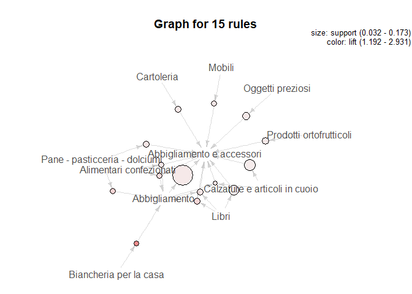 \`\`\`
